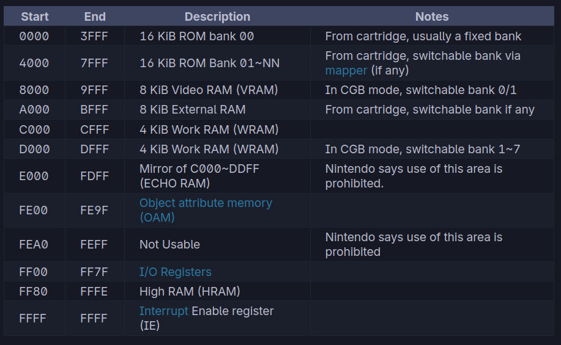
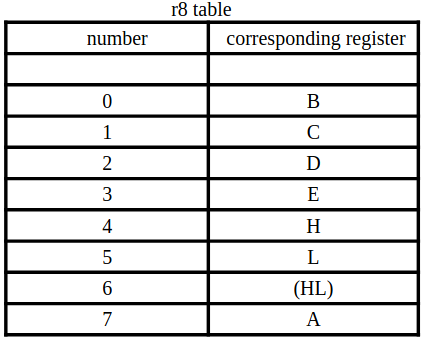

This is a fun little project I started over the summer in order to attempt to apply some
dynamic recompilation techniques to a commercial piece of hardware.

Legend of Zelda | Tetris
:-------------------------:|:-------------------------:
 | 


To delve into the specifics of dynamic recompilation, we first
need to have an emulator.
This post will detail how an emulator operates, and the following
will get into the specifics of a dynamic recompiler. Let's go!

## What is "emulation"?

Emulation involves running a guest system on a host system.
Here, the guest system is the original Nintendo Gameboy,
and the host system is my (or your) laptop.

he Gameboy's architecture differs significantly from modern hardware.
Its Sharp LR35902 CPU is based on the Zilog Z80 ISA,
unlike the x86 ISA of most current CPUs.
The custom Pixel Processing Unit (PPU) further sets it apart
as completely distant from current gen GPUs.
So, how do we play Gameboy games on modern hardware?
The answer: emulation.
By recreating the Gameboy's hardware and internal state through software,
we can `trick` games into thinking they're on authentic hardware when executed.

To begin the process, we start with the foundational element
in computer science: memory.

## The Gameboy's memory map

First, let's have a look at how the 16 bit memory bus of the Gameboy is structured
(courtesy of *[pandocs](https://gbdev.io/pandocs/)*):



From here we can see that the game's ROM is mapped from **0x0000** to **0x7FFF**. Great! Let's load the
game's rom into this region and start executing instructions.

## Executing instructions, an interpreter

The Gameboy's CPU starts with a program counter at **0x0000**
and features a stack pointer, along with registers **AF**,
**BC**, **DE**, and **HL**.
Gameboy instructions, variable in length, can be decoded using this
*[opcode table](https://izik1.github.io/gbops/)*.

Let's take an example: opcode **0x04** translates to **INC B**.
The *[instruction reference](https://rgbds.gbdev.io/docs/v0.5.1/gbz80.7#INC_r8)*
tells us how to recreate this instruction in software, so
let's look at how recompiler boy does it

```cpp
int GBInterpreter::inc_r8(Core& core, uint8_t r8) {
  // Decode which register is being incremented
  auto& src = get_r8(core, r8);

  // Set half carry flag
  core.set_flag(Regs::H, (src & 0xf) == 0xf);

  // Perform the opcode operation: increment the register
  src++;

  // Set zero flag
  core.set_flag(Regs::Z, src == 0);

  // Set negative flag to 0 unconditionally
  core.set_flag(Regs::N, false);

  return 0;
}
```

From this short example we can learn a lot of things:

* \> Every instruction can possibly modify one of four flags
  (ZNHC)

* \> Instructions can possibly encode which register they
  modify through the opcode itself

  *  From this
  we can see that bits 3-5 select the register from an
  opcode grouping here:
  
  Since **0x04** has the bits 3-5 set to 0, it selects the
  **B** register!

Phew, that's one instruction implemented. Only 511 more
to go. While this approach works (and is aptly called
an interpreter), it's very slow. The dynamic recompiler
in the next post aims to address that.

## The Pixel Processing Unit

The PPU of the Gameboy is a custom scanline renderer that
reads a **tilemap**, which indexes into **tiledata**.


## Interrupts, timing, and putting it all together

Once we implement the cpu using an interpreter and the ppu,
we can start booting some basic games and seeing some visual
output.

However, if we want to actually play games, then we have
to implement interrupts and correct timing of components
in order to have everything work nicely together.

## Future topics, and other readings

The project's future posts will delve into JIT compilation to optimize the emulator further.
The focus will be on enhancing performance and accuracy for a wide range of Gameboy games.

*[Next article](../recompiler_boy_part_2)*

Other blogs for further readings:

- \> https://www.copetti.org/writings/consoles/game-boy/
- \> https://emudev.de/gameboy-emulator/overview/
